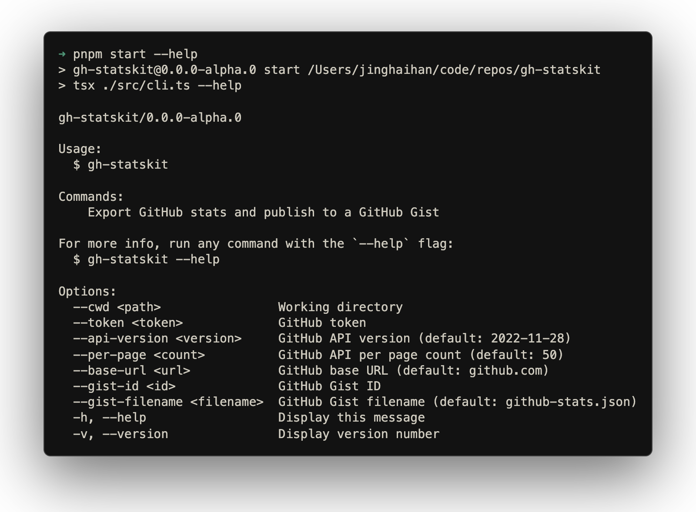

# GitHub Statskit

[![npm version][npm-version-src]][npm-version-href]
[![JSDocs][jsdocs-src]][jsdocs-href]
[![License][license-src]][license-href]

A CLI tool to export your GitHub stats and publish to a GitHub Gist. Automatically sync your contribution data to a Gist for easy sharing and tracking.

<p align='center'>

</p>

## Usage

### Local usage

Run the tool locally to export your stats:

```bash
export GH_PAT=your_github_token

# Export to local file
npx gh-statskit

# Update to Gist
npx gh-statskit --gist-id id
```

### GitHub CI usage

> [!IMPORTANT]
> Your Gist must already exist and contain a file with the specified filename (default: `github-stats.json`). You can customize the filename using the `--gist-filename` option.

**Set up GitHub Actions** to automatically sync your stats on a schedule:

```yaml
name: Upload GitHub Stats

on:
  push:
    branches: [main]
  schedule:
    - cron: '0 0 * * *'
  workflow_dispatch:

jobs:
  sync:
    runs-on: ubuntu-latest
    steps:
      - uses: actions/checkout@v4
        with:
          fetch-depth: 0

      - name: Set node
        uses: actions/setup-node@v4
        with:
          node-version: lts/*

      - name: Update to Gist
        run: npx gh-statskit
        env:
          GH_PAT: ${{ secrets.GH_PAT }}
          GIST_ID: ${{ secrets.GIST_ID }}
```

**Configure secrets in your repository**:
   - Go to your repository Settings > Secrets and variables > Actions
   - Add `GH_PAT` as a repository secret (your GitHub Personal Access Token)
   - Add `GIST_ID` as a repository secret (the ID of your Gist containing the configured filename, default: `github-stats.json`)

## Credits

This project is inspired by:
- [releases.antfu.me](https://github.com/antfu/releases.antfu.me) - @[Anthony Fu](https://github.com/antfu)
- [my-pull-requests](https://github.com/atinux/my-pull-requests) - @[Sébastien Chopin](https://github.com/atinux)
- [github-readme-stats](https://github.com/anuraghazra/github-readme-stats) - @[anuraghazra](github-readme-stats)

## License

[MIT](./LICENSE) License © [jinghaihan](https://github.com/jinghaihan)

<!-- Badges -->

[npm-version-src]: https://img.shields.io/npm/v/gh-statskit?style=flat&colorA=080f12&colorB=1fa669
[npm-version-href]: https://npmjs.com/package/gh-statskit
[npm-downloads-src]: https://img.shields.io/npm/dm/gh-statskit?style=flat&colorA=080f12&colorB=1fa669
[npm-downloads-href]: https://npmjs.com/package/gh-statskit
[bundle-src]: https://img.shields.io/bundlephobia/minzip/gh-statskit?style=flat&colorA=080f12&colorB=1fa669&label=minzip
[bundle-href]: https://bundlephobia.com/result?p=gh-statskit
[license-src]: https://img.shields.io/badge/license-MIT-blue.svg?style=flat&colorA=080f12&colorB=1fa669
[license-href]: https://github.com/jinghaihan/gh-statskit/LICENSE
[jsdocs-src]: https://img.shields.io/badge/jsdocs-reference-080f12?style=flat&colorA=080f12&colorB=1fa669
[jsdocs-href]: https://www.jsdocs.io/package/gh-statskit
